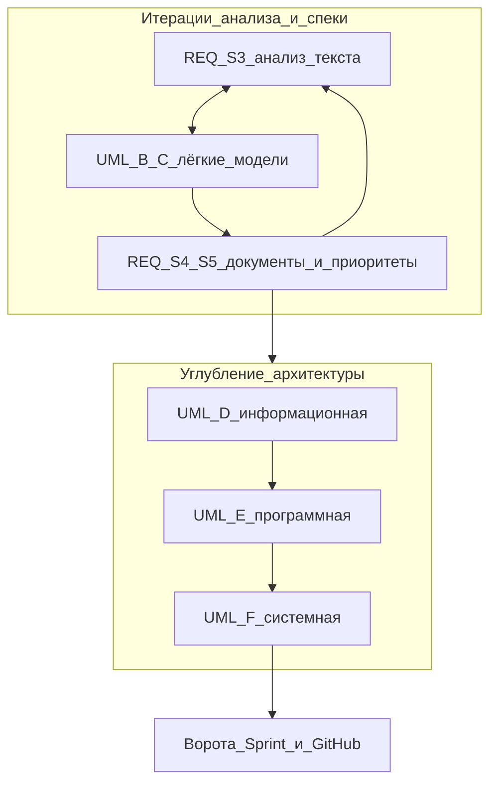

# Agent Workflow — REQ+UML (мастер)

**Назначение:** один порядок работы **в проекте**, где курсы «Управление требованиями» и «UML / архитектура ИС» **пересекаются**. Номера §1–7 ниже — логика [[Knowledge/Development/Requirements/Agent Workflow — от требований к спецификации|Agent Workflow — требования]]; шаги A–F — [[Knowledge/Development/Architecture/Agent Workflow — архитектура ИС и UML|Agent Workflow — архитектура ИС и UML]].

Для **ЖЦ vault, ворот и Scrum** см. блок «Канон ЖЦ для соло-проектов» в workflow требований и [[meta/lifecycle]] в этой же папке `meta/` проекта.

## Принцип: переплетение, не «сначала весь REQ, потом весь UML»

- На ранних этапах (особенно [[Knowledge/Development/Requirements/Agent Workflow — от требований к спецификации#3. Анализ, качество, модели на этапе анализа|§3 требований]]) уже допустимы **лёгкие модели** (use case, черновики деятельности, наброски классов) — это согласуется с шагами **A–C** UML-workflow.
- **Глубокая** проработка уровней D–E–F (информационная, программная, системная архитектура) и закрытие **чек-листа готовности** к реализации логичны **после** того, как структура BRD/SRS и приоритеты достаточно ясны (типично после §4–5 требований), с итерациями «текст ↔ модель».
- Два исходных workflow остаются **справочниками по курсам**; этот файл — **дорожная карта для агента и владельца проекта**.

## Старт с агентом

Как в workflow требований: триггер «начинаю проект X…» → **Старт проекта с агентом** там же (§2 стейкхолдеры, `SYNC.md`, GitHub). Заполнение артефактов — в `Projects/<Имя>/`.

## Матрица этапов (требования ↔ UML)

В ячейке «Углубление» — ссылки без псевдонимов `note|текст`, чтобы таблица не ломалась.

| Этап требований | Частые артефакты (vault) | UML / уровень ИС (если применимо) | Углубление |
|-----------------|---------------------------|-----------------------------------|------------|
| §1 Рамка | Глоссарий (черновик), виды требований | При необходимости границы системы / use case — шаг A | REQ [[Knowledge/Development/Requirements/Agent Workflow — от требований к спецификации#1. Рамка: определения, классификация, стандарты]] · UML [[Knowledge/Development/Architecture/Agent Workflow — архитектура ИС и UML#Шаг A — Зачем моделируем (лекция 1)]] |
| §2 Стейкхолдеры | `meta/stakeholders`, источники | Актёры для use case (черновик) | REQ [[Knowledge/Development/Requirements/Agent Workflow — от требований к спецификации#2. Стейкхолдеры, источники, сбор]] · UML [[Knowledge/Development/Architecture/Agent Workflow — архитектура ИС и UML#Шаг B — Функциональная архитектура: актёры и случаи]] |
| §3 Анализ | Проверенные формулировки, приоритеты черновиком | Лёгкие use case, activity, наброски классов | REQ [[Knowledge/Development/Requirements/Agent Workflow — от требований к спецификации#3. Анализ, качество, модели на этапе анализа]] · UML [[Knowledge/Development/Architecture/Agent Workflow — архитектура ИС и UML#Шаг B — Функциональная архитектура: актёры и случаи]], [[Knowledge/Development/Architecture/Agent Workflow — архитектура ИС и UML#Шаг C — Потоки и правила]], при необходимости [[Knowledge/Development/Architecture/Agent Workflow — архитектура ИС и UML#Шаг D — Информационная модель]] |
| §4 Документирование | BRD, SRS, FRS, трассировка | Уточнение use case / activity / концептуальный класс | REQ [[Knowledge/Development/Requirements/Agent Workflow — от требований к спецификации#4. Документирование: зрелость, BRD → SRS → FRS, ГОСТ при необходимости]] · UML [[Knowledge/Development/Architecture/Agent Workflow — архитектура ИС и UML#2. От артефактов требований к моделям]] |
| §5 Приоритизация, В&В | MoSCoW / бэклог, ревью | Модели для верификации сценариев | [[Knowledge/Development/Requirements/Agent Workflow — от требований к спецификации#5. Приоритизация, верификация, валидация]] |
| §6–7 изменения и процесс | CR, трассировка, спринты | Диаграммы по impact; полные D–F перед воротами | REQ [[Knowledge/Development/Requirements/Agent Workflow — от требований к спецификации#6. Управление изменениями и трассировка]], [[Knowledge/Development/Requirements/Agent Workflow — от требований к спецификации#7. Согласование с методологией поставки]] · UML [[Knowledge/Development/Architecture/Agent Workflow — архитектура ИС и UML#Шаг D — Информационная модель]], [[Knowledge/Development/Architecture/Agent Workflow — архитектура ИС и UML#Шаг E — Программная архитектура]], [[Knowledge/Development/Architecture/Agent Workflow — архитектура ИС и UML#Шаг F — Системная архитектура]] |

Перед воротами к спринту: [[Knowledge/Development/Architecture/Agent Workflow — архитектура ИС и UML#4. Чек-лист готовности к реализации]] и [[Knowledge/Development/Architecture/Agent Workflow — архитектура ИС и UML#Handoff → реализация (Scrum)]].

## HumanOnly

- 
